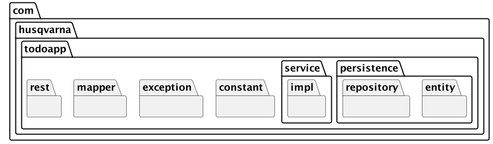
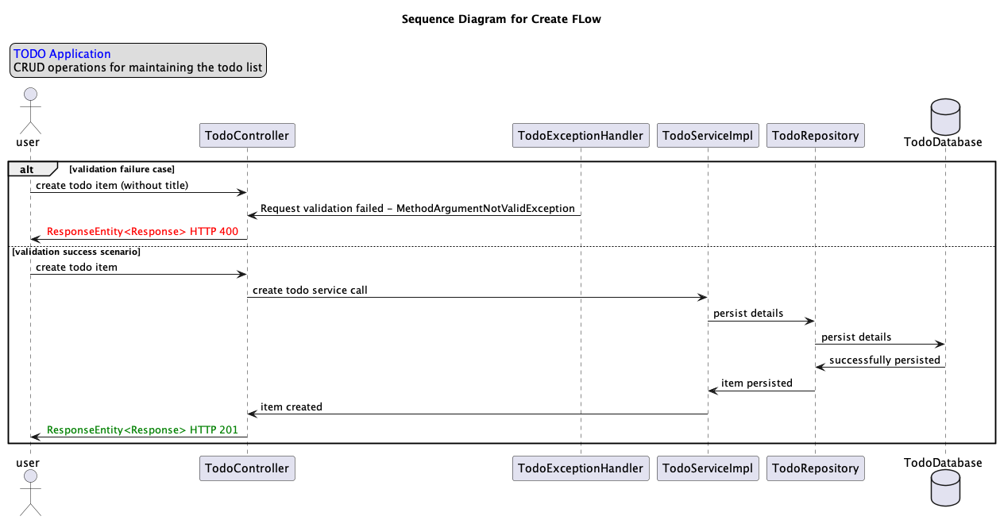
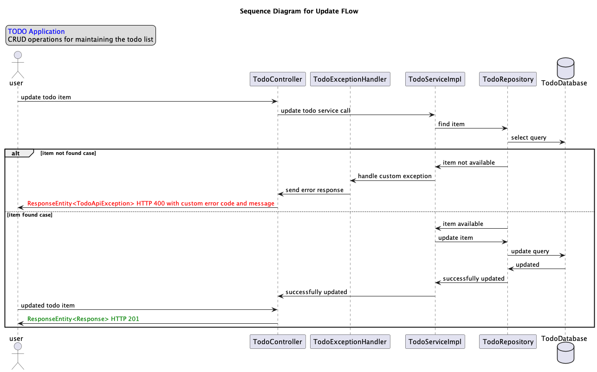

### Introduction
This Application provides services to manage the todo items.


### Package Diagram


### Sequence Diagram 



### Build and Run Information
Build and run the application using maven commands.
<br>Once started you will find the server start information in the logs 
```
2024-01-27T13:32:20.030+05:30  INFO 12655 --- [           main] o.s.b.w.embedded.tomcat.TomcatWebServer  : Tomcat started on port(s): 8080 (http) with context path ''
2024-01-27T13:32:20.038+05:30  INFO 12655 --- [           main] c.husqvarna.todoapp.TodoappApplication   : Started TodoappApplication in 1.897 seconds (process running for 2.195)
2024-01-27T13:32:20.230+05:30  INFO 12655 --- [)-192.168.0.112] o.a.c.c.C.[Tomcat].[localhost].[/]       : Initializing Spring DispatcherServlet 'dispatcherServlet'
2024-01-27T13:32:20.230+05:30  INFO 12655 --- [)-192.168.0.112] o.s.web.servlet.DispatcherServlet        : Initializing Servlet 'dispatcherServlet'
2024-01-27T13:32:20.231+05:30  INFO 12655 --- [)-192.168.0.112] o.s.web.servlet.DispatcherServlet        : Completed initialization in 1 ms
```

### Once started, Service would be reachable at
```yaml
 - url: http://localhost:8080
 - POST: /todo-requests
 - GET: /todo-requests
 - GET: /todo-requests/{id}
 - PATCH: /todo-requests/{id}
 - DELETE: /todo-requests/{id}
```

### Service health can be monitored at 
[Service Health URL](http://localhost:8080/actuator/health) 
http://localhost:8080/actuator/health

### H2 Database console is available at 
[H2 Console](http://localhost:8080/h2-console) 
http://localhost:8080/h2-console


### Release Information 
| Version | Changes                                             |                           
|---------|-----------------------------------------------------|
| 0.0.1   | Todo Application Service  providing CRUD Operations |  